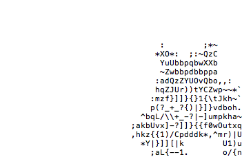

### etos-deepcut 

A tool for object segmentation from extreme points. for [ETOS](https://etos.world) Ecosystem.

### About Deep Extreme Cut (DEXTR)

Visit [project page](http://www.vision.ee.ethz.ch/~cvlsegmentation/dextr) for accessing the paper, and the pre-computed results.


This is  based the implementation of `Deep Extreme Cut (DEXTR)`, for object segmentation from extreme points.

### Installation

0. Clone the repo:
    ```Shell
    git clone https://github.com/etosworld/etos-deepcut
    cd etos-deepcut
    ```
 
1. Install dependencies:
    ```Shell
    pip install -r requirements.txt
    ```
  
2. Download the model by running the script inside ```models/```:
    ```Shell
    cd models/
    chmod +x download_dextr_model.sh
    ./download_dextr_model.sh
    cd ..
    ```
    The default model is trained on PASCAL VOC Segmentation train + SBD (10582 images). To download models trained on PASCAL VOC Segmentation train or COCO, please visit [project page](http://www.vision.ee.ethz.ch/~cvlsegmentation/dextr/#downloads), or keep scrolling till the end of this README.

3. To try the demo version of etos-deepcut, please run:
    ```Shell
    python demo.py
    ```
If installed correctly, the result should look like this:
<p align="center"></p>

### image2txt

we have implemented the [image2txt](https://github.com/etosworld/etos-img2txt) function , for each segmented object, an image and text file would be saved.enjoy!

 


### Training 

To train and evaluate etos-deepcut on PASCAL (or PASCAL + SBD), please follow these additional steps:

4. Install tensorboard (integrated with PyTorch). 
    ```Shell
    pip install tensorboard tensorboardx
    ```

5. Download the pre-trained PSPNet model for semantic segmentation, taken from [this](https://github.com/isht7/pytorch-deeplab-resnet) repository.
    ```Shell
    cd models/
    chmod +x download_pretrained_psp_model.sh
    ./download_pretrained_psp_model.sh
    cd ..
    ```
6. Set the paths in ```mypath.py```, so that they point to the location of PASCAL/SBD dataset.

7. Run ```python train_pascal.py```, after changing the default parameters, if necessary (eg. gpu_id).

Enjoy!!

### Pre-trained models

you can download the following DEXTR models, pre-trained on:
  * [PASCAL + SBD](https://data.vision.ee.ethz.ch/kmaninis/share/DEXTR/Downloads/models/dextr_pascal-sbd.pth), trained on PASCAL VOC Segmentation train + SBD (10582 images). Achieves mIoU of 91.5% on PASCAL VOC Segmentation val.
  * [PASCAL](https://data.vision.ee.ethz.ch/kmaninis/share/DEXTR/Downloads/models/dextr_pascal.pth), trained on PASCAL VOC Segmentation train (1464 images). Achieves mIoU of 90.5% on PASCAL VOC Segmentation val.
  * [COCO](https://data.vision.ee.ethz.ch/kmaninis/share/DEXTR/Downloads/models/dextr_coco.pth), trained on COCO train 2014 (82783 images). Achieves mIoU of 87.8% on PASCAL VOC Segmentation val.

### TODO

- to support deep extreme video cut

### Citation

	@Inproceedings{Man+18,
	  Title          = {Deep Extreme Cut: From Extreme Points to Object Segmentation},
	  Author         = {K.K. Maninis and S. Caelles and J. Pont-Tuset and L. {Van Gool}},
	  Booktitle      = {Computer Vision and Pattern Recognition (CVPR)},
	  Year           = {2018}
	}

	@InProceedings{Pap+17,
	  Title          = {Extreme clicking for efficient object annotation},
	  Author         = {D.P. Papadopoulos and J. Uijlings and F. Keller and V. Ferrari},
	  Booktitle      = {ICCV},
	  Year           = {2017}
	}


